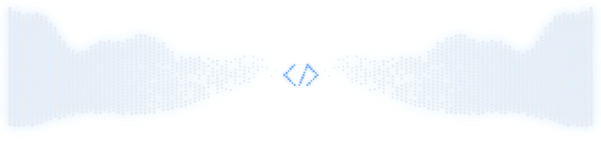

  

  
  

Escrevo código desde os 13 anos — começou como curiosidade, virou profissão. Hoje trabalho full-time na Ndevs Solutions enquanto termino a Etec (Informática pra Internet). Atuo com C#, ASP.NET e SQL no dia a dia — desenvolvimento backend, criação de APIs e integração entre sistemas, além de manutenção de aplicações corporativas. No TCC uso Java, aprofundando arquitetura backend e APIs escaláveis.

Sempre aberto a aprender, colaborar em projetos e trocar ideia com quem também curte backend.

  <picture>
    <source media="(prefers-color-scheme: dark)" srcset="assets/dots-dark.svg">
    <source media="(prefers-color-scheme: light)" srcset="assets/dots-light.svg">
    
  </picture>

<table>
<tr>
<td align="center" valign="top" width="50%">

### Backend
   
 
 

</td>
<td align="center" valign="top" width="50%">

### Frontend
  

</td>
</tr>
<tr>
<td align="center" colspan="2" valign="top">

### Dados
  

</td>
</tr>
</table>

### Atividade

  

  <picture>
    <source media="(prefers-color-scheme: dark)" srcset="https://raw.githubusercontent.com/GuilhermeSzFernandes/GuilhermeSzFernandes/output/github-contribution-grid-snake-dark.svg">
    <source media="(prefers-color-scheme: light)" srcset="https://raw.githubusercontent.com/GuilhermeSzFernandes/GuilhermeSzFernandes/output/github-contribution-grid-snake.svg">
    
  </picture>

Bora trocar ideia sobre backend, arquitetura de API ou vaga de júnior/pleno.

📧 [guilhermeszfernandes@outlook.com](mailto:guilhermeszfernandes@outlook.com) · 💼 [linkedin.com/in/guilhermeszfernandes](https://www.linkedin.com/in/guilhermeszfernandes)
